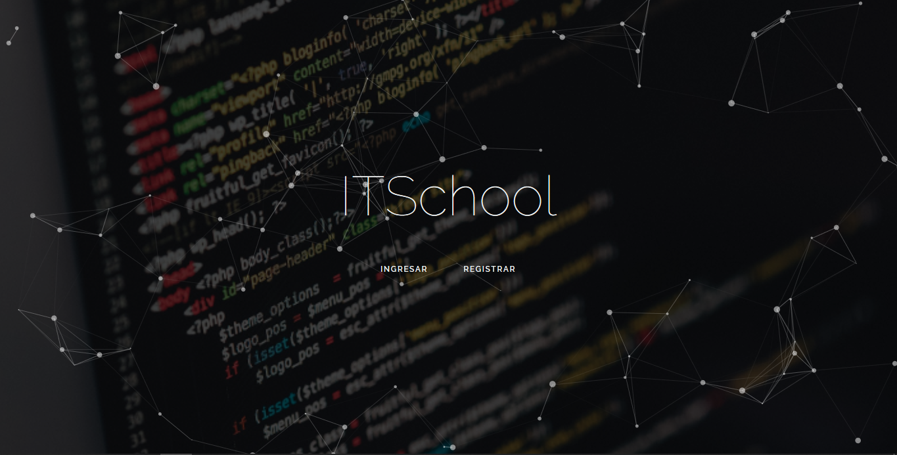

# ITSchool
Bienvenido al repositorio de ITSchool, plataforma de aprendizaje tipo e-learning desarrollada con Laravel para la materia Interaccion Humano-Computadora.
## Resumen
Plataforma de aprendizaje tipo e-learning que busca facilitar el aprendizaje de tecnologías de la información a cualquiera que desee hacerlo con motivos ya sean académicos, laborales, entre otros.
## Pantalla principal

## Menu principal

## Ejemplo de una actividad
